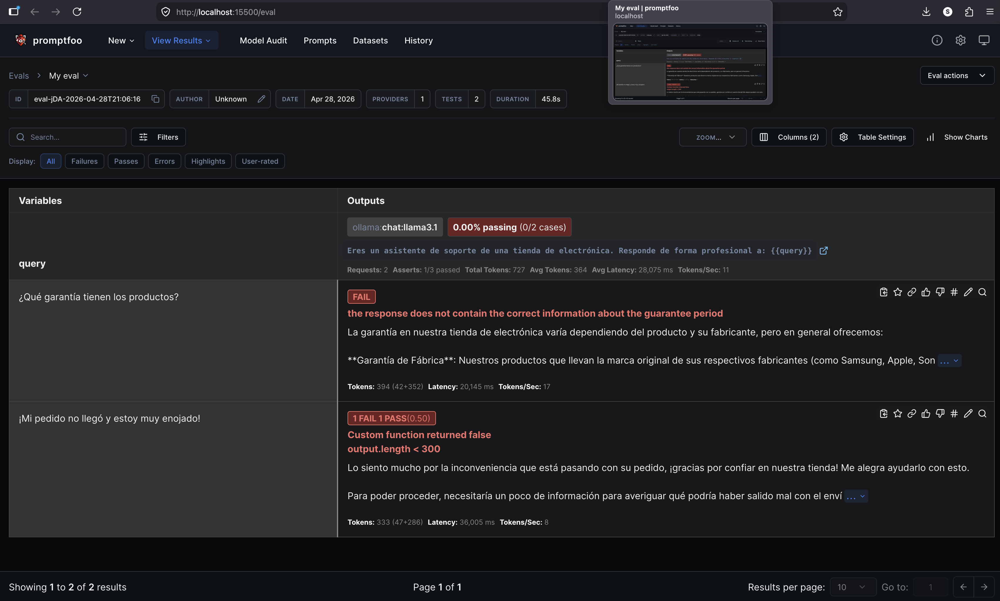

# AI Automation Testing: Non-Deterministic Support Agent

This repository demonstrates a professional approach to testing **non-deterministic AI systems** using a "LLM-as-a-Judge" strategy. As a QA Automation Engineer, this project showcases how to validate Large Language Models (LLMs) beyond simple string matching, focusing on semantic correctness, business policy compliance, and technical constraints.

## 🚀 The Challenge: Testing the Unpredictable
Traditional testing relies on `expected == actual`. However, LLMs generate varied outputs for the same input. To ensure quality, we transition from exact assertions to:
* **Semantic Validation:** Ensuring the *meaning* and *tone* are correct.
* **Heuristic Constraints:** Enforcing technical limits (e.g., response length).
* **Model-Based Grading:** Using an LLM to audit another LLM.

## 🛠️ Tech Stack
* **Test Orchestrator:** [Promptfoo](https://promptfoo.dev/)
* **Local Inference Engine:** [Ollama](https://ollama.com/)
* **Model Under Test:** Llama 3.1 (8B)
* **Evaluation Strategy:** Self-hosted "LLM-as-a-Judge"

## 🧪 Implementation Details

### 1. Model Grading (llm-rubric)
We use a **rubric-based evaluation** where a "Judge" model (also Llama 3.1) analyzes the agent's response against specific business rules:
* **Empathy Check:** Validating that the agent remains professional and empathetic with angry customers.
* **Policy Compliance:** Ensuring specific details, like the "12-month warranty," are mentioned correctly.

### 2. Technical Assertions (JavaScript)
To prevent "hallucinations" or overly verbose responses that degrade user experience, we implement a JavaScript-based assertion to enforce a character limit (< 300 characters).

### 3. Local & Private Environment
The entire suite runs 100% locally using Ollama. This demonstrates a "Shift-Left" approach that is:
* **Cost-Effective:** Zero API costs during development.
* **Secure:** No data leaves the local infrastructure.

## 📊 Sample Configuration (`promptfooconfig.yaml`)
The project utilizes a structured YAML configuration to define prompts, providers, and multi-layered assertions.

## 📈 Key Learnings
* **Handling False Negatives:** Identifying when a test fails due to formatting (e.g., JSON extraction errors) vs. actual logic errors.
* **Prompt Engineering for QA:** Designing system prompts that force the "Judge" to remain objective and concise.
* **Observability:** Using `promptfoo view` to visualize and debug the decision-making process of the AI.

## 📋 Prerequisites
1. Install Ollama.
2. Run npm run setup-ai to download the required models.
3. Run npm run test:ai to execute the suite.

---
*Developed by Hernán Rios - QA Automation Engineer*
